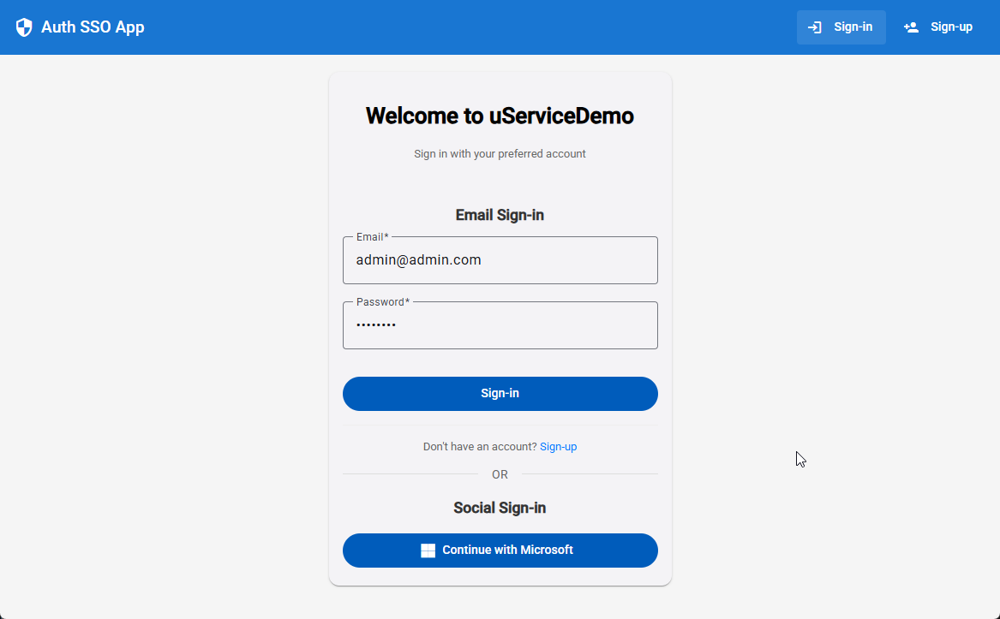
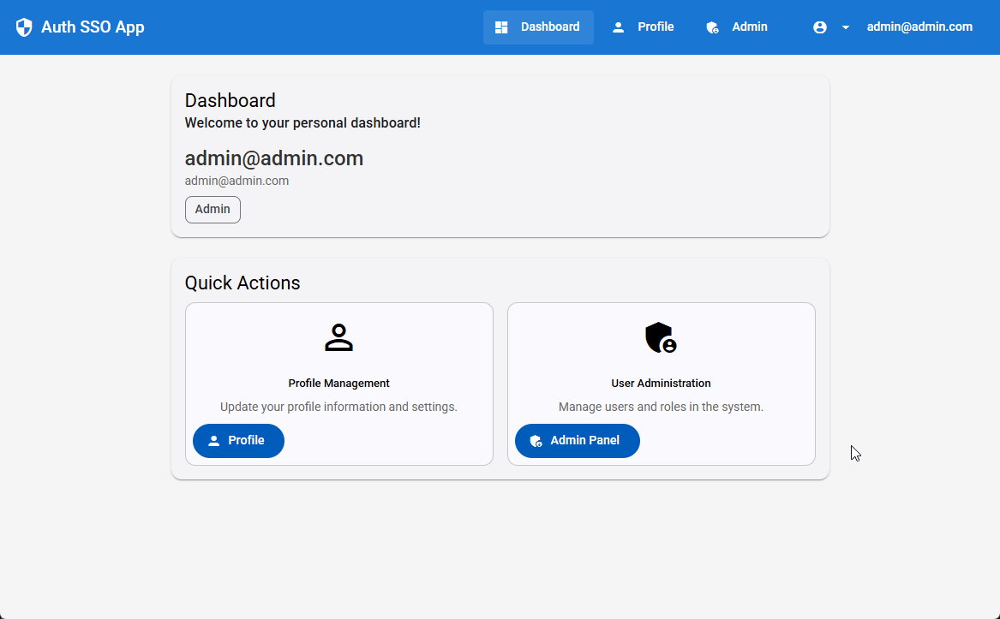
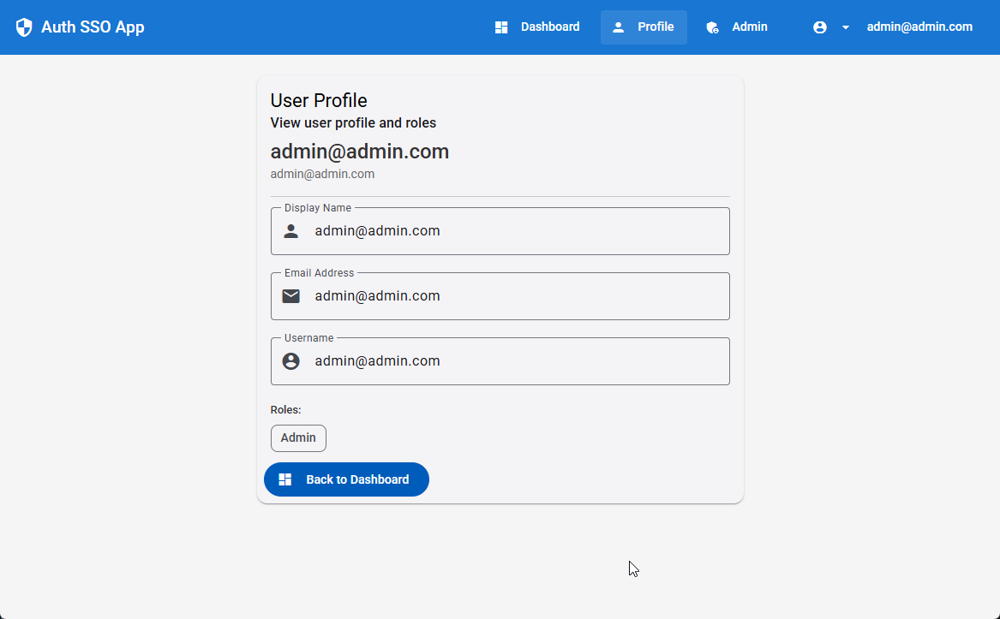
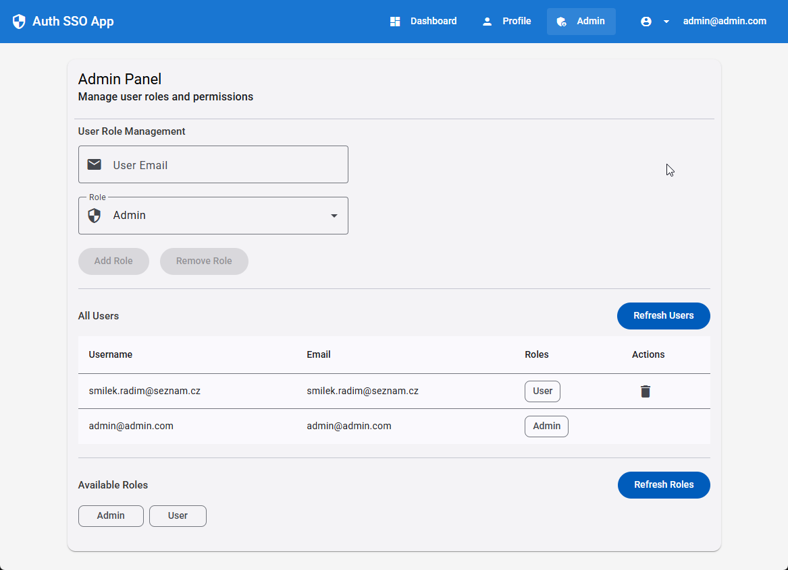

# Microservices Overview

[Microservices Summary Documentation](./Doc/MicroservicesSummary.md) - Microsoft OAuth / Email, JWT, Role-based auth


# MicroServicesDemo

A complete microservices demonstration project featuring:
- ASP.NET Core 10 Auth API with Microsoft OAuth integration + email authentication
- ASP.NET Identity + role-based authorization
- JWT token API authentication
- Email service with Azure Communication Services
- Async inter-service communication with Azure Service Bus
- Angular 20.1 frontend with Material Design + Comprehensive role management system

## See Also

- [Authentication API - Full Documentation](./Services/Msd.Services.AuthApi/README.md) - Microsoft OAuth / Email, JWT, Role-based auth
- [Email API - Full Documentation](./Services/Msd.Services.EmailApi/README.md) - Azure Communication Services integration, setup guide
- [Message Bus Integration - Full Documentation](./Services/Msd.Integration.MessageBus/README.md) - Azure Service Bus, inter-service communication
- [Frontend Application - Full Documentation](./App/README.md) - Angular SPA with Material Design

## App Architecture


## Gallery

| | |
|---|---|
|  |  |
|  |  |

## Project Structure

```
MicroServicesDemo/
├── Doc/                          # Documentation and Assets
│   ├── Msd.Flowchart.png         # Application architecture flowchart
│   └── Gallery/                  # Gallery images
├── Services/                     # Backend API Services
│   ├── Msd.Services.sln          # Solution file
│   ├── Msd.Integration.MessageBus/  # Message Bus Integration Library
│   │   ├── IMessageBus.cs        # Message bus interface
│   │   ├── MessageBus.cs         # Azure Service Bus implementation
│   │   ├── Models/               # Data models
│   │   │   └── Dtos/             # Data Transfer Objects
│   │   └── README.md             # Documentation
│   ├── Msd.Services.AuthApi/     # Authentication API Service
│   │   ├── Controllers/          # API Controllers
│   │   ├── Data/                 # Entity Framework DbContext
│   │   ├── Models/               # DTOs and Data Models
│   │   ├── Services/             # Business Logic Services
│   │   ├── Extensions/           # Configuration extensions
│   │   ├── Migrations/           # Database Migrations
│   │   └── README.md             # Documentation
│   └── Msd.Services.EmailApi/    # Email API Service
│       ├── Controllers/          # API Controllers
│       ├── Models/               # DTOs and Data Models
│       ├── Services/             # Email Services
│       ├── Messaging/            # Service Bus consumer
│       ├── Extensions/           # Configuration extensions
│       └── README.md             # Documentation
└── App/                          # Angular Frontend Application
    ├── src/app/components/       # UI Components
    ├── src/app/services/         # Angular Services
    ├── src/app/guards/           # Route Guards
    └── src/app/models/           # TypeScript Models
```

## Quick Start

### 1. Backend API Setup

**Authentication API:**
```bash
cd Services
dotnet restore
dotnet ef database update --project Msd.Services.AuthApi
dotnet run --project Msd.Services.AuthApi
```
*API will be available at: https://localhost:5001*

**Email API:**
```bash
cd Services
dotnet restore
dotnet run --project Msd.Services.EmailApi
```
*API will be available at: https://localhost:7003*

### 2. Frontend App Setup
```bash
cd App
npm install
npm start
```
*App will be available at: http://localhost:4200*

## Default Authentication

**Admin Account:**
- Email: `admin@admin.com`
- Password: `Admin123`

## Technology Stack

**Backend:**
- .NET 10.0
- ASP.NET Core Identity
- Entity Framework Core
- JWT Authentication
- Microsoft OAuth 2.0
- Azure Communication Services
- SQL Server

**Frontend:**
- Angular 20.1
- Angular Material
- TypeScript 5.8
- RxJS
- SCSS


